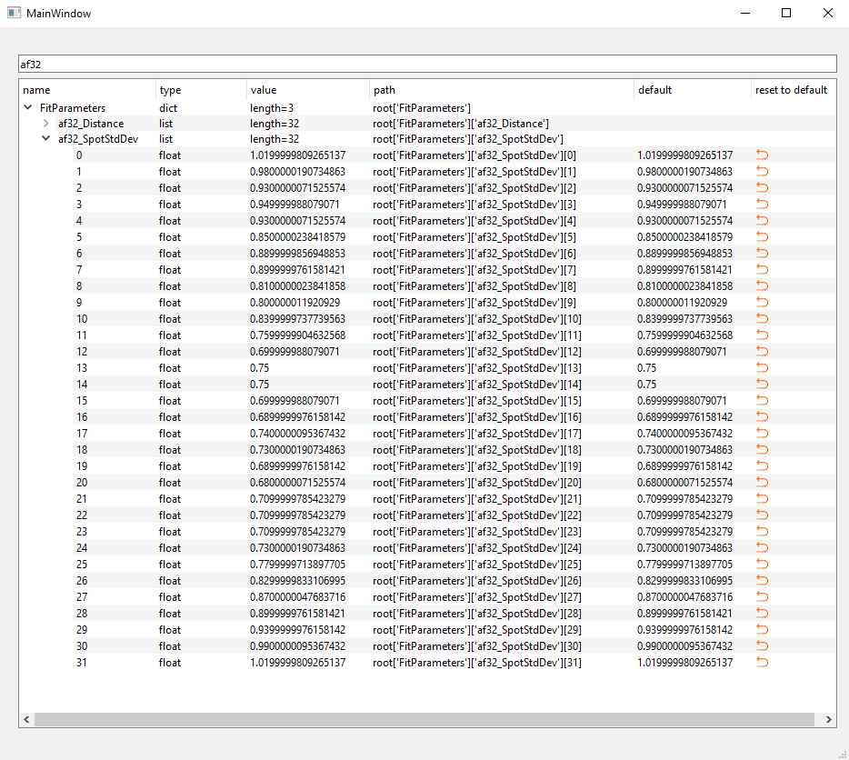

Tutorial
========

Create an instance of ``dicttotreeview`` and initialize it with a ``dictionary`` and a ``QTreeView``.
Connect your signal of data to ``dicttotreeview.data_sig``.
To get the reverse actualization connect also ``dicttotreeview.output_sig`` with your self defined method to update your local dictionary. 
 
.. code:: python

    if __name__ == "__main__":

        app = QtWidgets.QApplication(sys.argv)
        window = MainWindow()

        #sensor to test
        ###############
        sensor = DummySensor()
        ###############

        #dicttotreeview 
        ###############
        myInstance = DictToTreeView(sensor.data_dict, window.TreeView, reset_column=True, highlight_changes=True)
        myInstance.tree.ShowPathColumn(True)#Flag for path column 
        ###############
        
        #signals
        ########
        sensor.sensor_data_sig.connect(myInstance.data_sig)#connect input data
        myInstance.output_sig.connect(sensor.update_dc)#connect output data

        window.ui.lineEdit.textChanged.connect(myInstance.tree.filter_model)#activate SearchingLine 
        ########

        window.show() 
        sys.exit(app.exec_())

For further information see `example`_ .

.. _example: https://gitlab.baumernet.org/bech/rd/po1/personal/egr/dicttotreeview/-/tree/master/examples

   

**Enable reset column:**

.. code:: python

    DictToTreeView(data_dict, TreeView, reset_column=True)

**Enable colorful highlighting of changed values:**

.. code:: python

    DictToTreeView(data_dict, TreeView, highlight_changes=True)

**Enable TreeSearch:**

Define a line in your window that gets connected with the ``dicttotreeview.tree.filter_model`` method.

.. code:: python

    window.ui.lineEdit.textChanged.connect(myInstance.tree.filter_model)#activate SearchingLine

**Set flag for path column:**

See the tree structure in paths.

.. code:: python

    from dicttotreeview import DictToTreeView

    myInstance = DictToTreeView(data_dict, TreeView)
    myInstance.tree.ShowPathColumn(True)

For connecting signals see ``main.py`` in ``examples/``.

**Graphical User Interface could look like this:** 

